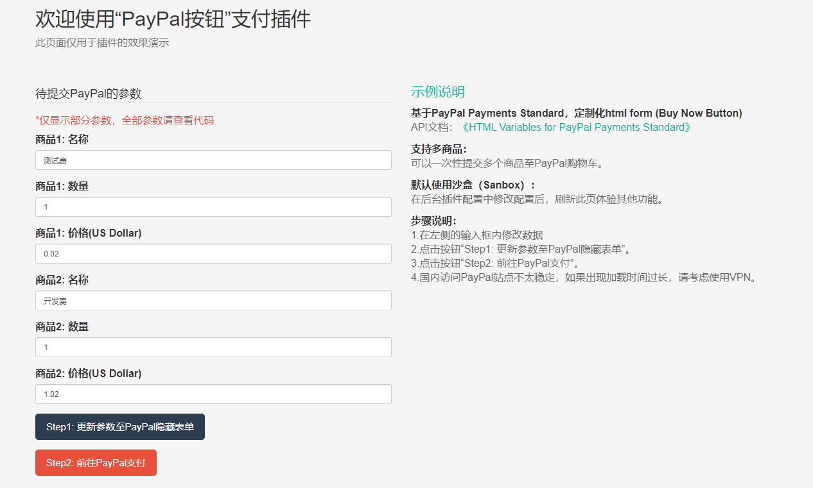

### 功能介绍
> 快速接入PayPal支付能力，尤其适合外贸/电商网站。



### 功能特性
- 免除阅读繁琐的英文PayPal开发文档。
- "支付调用"和"支付回调"都以标签形式调用，无需改动现有的任何代码文件。
- 以html form表单形式POST给PayPal平台，灵活，可自定义。

### 准备工作
- 申请PayPal企业帐号或沙箱（Sanbox）帐号。
- 在后台插件管理处，配置相关参数。

### 示例
> 插件安装完毕后，请务必清除站点缓存，否则标签位无法生效。刷新缓存后可以访问/addons/paypal/index.html页面，该页面是一个包含支付成功回调界面的完整例子。

### 发起支付（内嵌至其他html页面）
以标签位的形式调用，“pp_button_init”会渲染输出一段html代码，其中包含一个隐藏的表单和一个submit按钮。点击该按钮，则会跳转至PayPal支付界面。
```
#$ppForm是要初始化的订单数据
{:hook('pp_button_init', $ppForm)}
```

### 回调通知（Instant Payment Notification）
回调通知url默认是/addons/paypal/callback/ipn, 支付成功后，PayPal服务器会POST交易数据至此入口。
```php
   /**
     * 接收即时付款通知(Instant Payment Notification)
     * notify_url默认填写此处url
     */
    public function ipn(){
        $addonCfg = get_addon_config('paypal');
        $isSanbox = isset($addonCfg['is_sandbox']) ? (int)$addonCfg['is_sandbox'] : 0;
        $isDebug = isset($addonCfg['is_debug']) ? (int)$addonCfg['is_debug'] : 0;
        $post = $this->request->post();

        if(!$this->request->isPost()){
            return '';
        }

        if(!isset($post['payment_status']) || 'Completed'!==$post['payment_status']){
            //每次付款，可能会接收到多个不同支付状态的IPN信息，非Completed状态的信息全部跳过
            return '';
        }

        if($isDebug){
            Log::record($post, 'debug');
        }

        $ipn = new PaypalIPN();

        if($isSanbox){
            $ipn->useSandbox();
        }

        try {
            $verified = $ipn->verifyIPN();
            if ($verified && 'Completed'===$post['payment_status']) {
                /**
                 * IPN信息验证通过，并支付状态为Completed。
                 * 注意：基于安全因素，开发者仍需自行在Behavior中验证下列3项：
                 * 1. check that $post['txn_id'] has not been previously processed
                 * 2. check that $post['receiver_email'] is your Primary PayPal email
                 * 3. check that $post['mc_gross']/$post['mc_currency'] are correct
                 */

                # 调用钩子进行下一步的业务处理
                $passData = [$post, $addonCfg];
                Hook::listen("pp_ipn_verified", $passData);
            }else if($isDebug){
                Log::record($post, 'debug');
            }
        } catch (Exception $e) {
            Log::record($e->getMessage(), 'error');
        }


        //返回空的HTTP 200
        return '';
    }
```
请在您的业务代码中提前监听“pp_ipn_verified”标签，以便实现业务对接。也可自行修改此函数。

### 配置说明
| 配置项 | 说明 |
| ----- | ----- |
| PayPal Account E-mail | 您的收款账号 |
| Sandbox Mode | Yes:使用沙盒环境; NO:正式环境 |
| Debug Mode | Yes:输出回调数据至Log文件 |
| Transaction Method | 一般选择Sale即可，详情请查看官网说明 |

### 常见问题
1.支付回调如何开发调试？
> 推荐使用ngrok,一款超小体积的隧道工具，可以一键开通公网访问你本地机器的代理链接，支持https映射至http。详见ngrok官方教程。

2.跳转至PayPal支付页面时，加载时间过长或者显示服务商连接失败？
> 请检查你本地的网络环境，是否可以正常访问PayPal的站点
